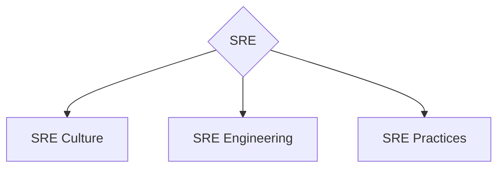
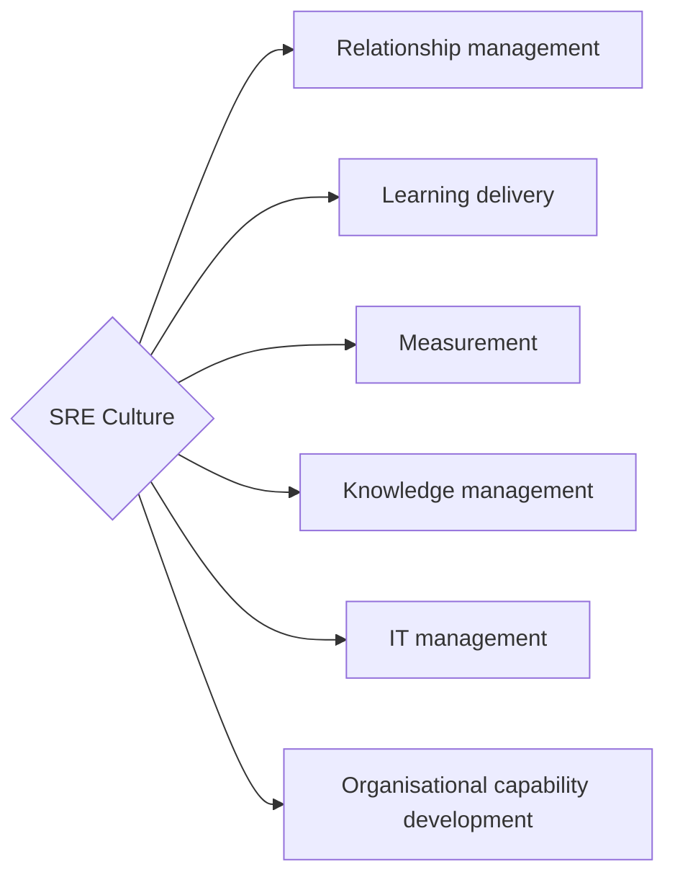
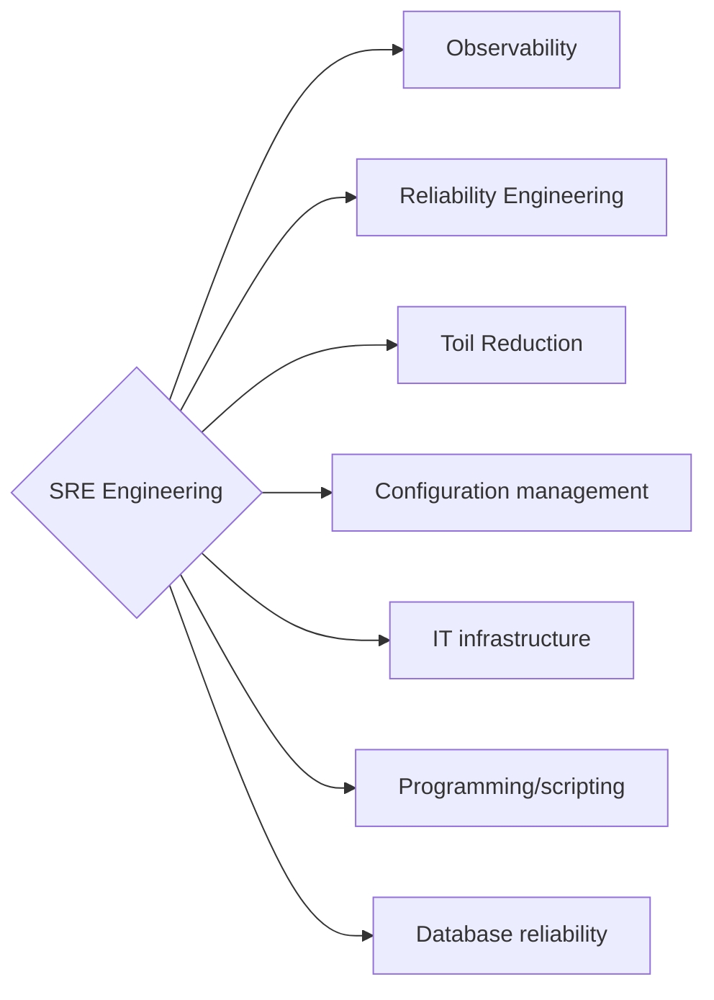
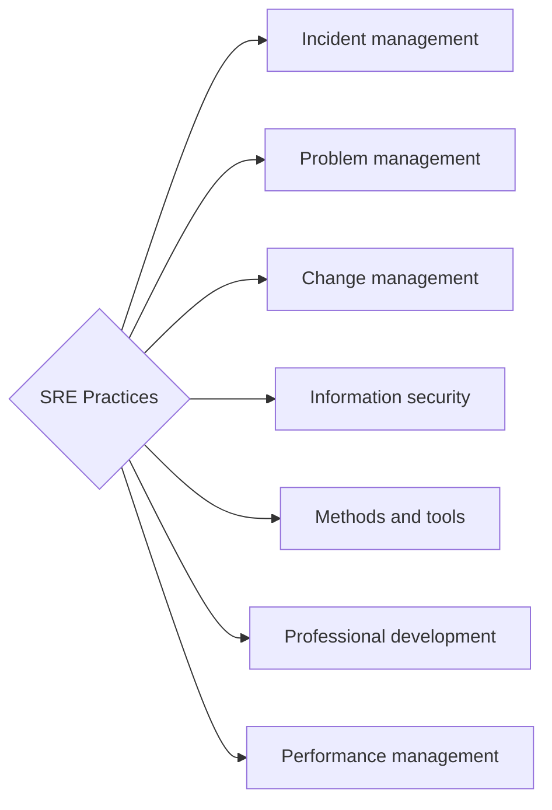

<h1 align="center">Привет, инженер
</h1>
<h2 align="center"> Всем, кому интересно развиваться в SRE направлении, посвящается! </h2>

  
  

  

> Вдохновлен проектом [The-Way-of-DevOps](https://github.com/evgeniy-kharchenko/The-Way-of-DevOps) за авторством [Евгения Харченко](https://github.com/evgeniy-kharchenko).

<!-- START doctoc generated TOC please keep comment here to allow auto update -->
<!-- DON'T EDIT THIS SECTION, INSTEAD RE-RUN doctoc TO UPDATE -->

- [Про мотивацию](#%D0%BF%D1%80%D0%BE-%D0%BC%D0%BE%D1%82%D0%B8%D0%B2%D0%B0%D1%86%D0%B8%D1%8E)
- [О работе](#%D0%BE-%D1%80%D0%B0%D0%B1%D0%BE%D1%82%D0%B5)
- [Дисклеймер](#%D0%B4%D0%B8%D1%81%D0%BA%D0%BB%D0%B5%D0%B9%D0%BC%D0%B5%D1%80)
- [О методологической базе](#%D0%BE-%D0%BC%D0%B5%D1%82%D0%BE%D0%B4%D0%BE%D0%BB%D0%BE%D0%B3%D0%B8%D1%87%D0%B5%D1%81%D0%BA%D0%BE%D0%B9-%D0%B1%D0%B0%D0%B7%D0%B5)
- [The way of SRE](#the-way-of-sre)
  - [Основные ветви для развития в SRE направлении](#%D0%BE%D1%81%D0%BD%D0%BE%D0%B2%D0%BD%D1%8B%D0%B5-%D0%B2%D0%B5%D1%82%D0%B2%D0%B8-%D0%B4%D0%BB%D1%8F-%D1%80%D0%B0%D0%B7%D0%B2%D0%B8%D1%82%D0%B8%D1%8F-%D0%B2-sre-%D0%BD%D0%B0%D0%BF%D1%80%D0%B0%D0%B2%D0%BB%D0%B5%D0%BD%D0%B8%D0%B8)
  - [SRE Culture](#sre-culture)
  - [SRE Engineering](#sre-engineering)
  - [SRE Practices](#sre-practices)
  - [Рекомендуемый Roadmap для развития](#%D1%80%D0%B5%D0%BA%D0%BE%D0%BC%D0%B5%D0%BD%D0%B4%D1%83%D0%B5%D0%BC%D1%8B%D0%B9-roadmap-%D0%B4%D0%BB%D1%8F-%D1%80%D0%B0%D0%B7%D0%B2%D0%B8%D1%82%D0%B8%D1%8F)

<!-- END doctoc generated TOC please keep comment here to allow auto update -->

## Про мотивацию

В IT индустрии существует множество карт развития.
Различные дорожные карты базируются на различных направлениях, компетенциях и т.д.
Данная работа сосредоточена именно на развитии инженеров, которые работают в роли Site Reliability Engineer (SRE), а также для людей, которые хотят развиваться в этом направлении.
Данный проект сделан для передачи опыта и создания единого видения развития компетенций в SRE направлении в русскоязычном сообществе.

## О работе

- SRE MindMap — рассмотрим все возможные и рекомендованные к развитию ветви
- SRE Roadmap — рассмотрим инкрементальное приращение экспертизы и предполагаемый путь развития

## Дисклеймер

Предлагаемый путь развития не является:

- серебряной пулей, решающей все проблемы
- истиной, за которой нужно слепо следовать

## О методологической базе

Все рекомендации и путь развития построен на базе собственного опыта, а также опыта других инженеров.
В качестве методологической базы используются:

- [Google SRE Book](https://sre.google/sre-book/table-of-contents/)
- [Google SRE Workbook](https://sre.google/workbook/table-of-contents/)
- [SFIA DevOps View](https://sfia-online.org/en/tools-and-resources/sfia-views/devops-skills-in-sfia)
- [DORA Research](https://dora.dev/)

---

## The way of SRE

### Основные ветви для развития в SRE направлении

- **SRE Culture** — ветвь развития, посвящена совершенствованию компетенций и навыков, связанных с построением культуры надёжности в организации. Деятельность в этом направлении призвана сформировать безвиновую культуру (blameless culture), развить reliability mindset, наладить on-call культуру и обеспечить эффективный обмен знаниями. Ключевой принцип: надёжность — это фича, а не afterthought.

- **SRE Engineering** — ветвь развития, посвящена совершенствованию технических компетенций и навыков, необходимых для обеспечения надёжности, масштабируемости и производительности систем. Включает наблюдаемость (observability), управление SLO/SLI/SLA, снижение toil, chaos engineering, capacity planning и всё, что позволяет системам быть надёжными по своей природе.

- **SRE Practices** — ветвь развития, посвящена совершенствованию операционных процессов: управление инцидентами, постмортемы, управление изменениями, on-call процессы, runbook-культура и SLO-ревью. Всё это составляет операционную зрелость команды и организации.

---

### SRE Culture

Компетенции для развития в ветке `SRE Culture`:

- **Relationship management** — деятельность, связанная с выстраиванием партнёрства между SRE и продуктовыми командами, управлением ожиданиями стейкхолдеров, формированием культуры совместной ответственности за надёжность. SRE работают вместе с разработчиками, а не вместо них.

- **Learning delivery** — деятельность, направленная на распространение SRE-знаний внутри организации: проведение game day, обучение командам incident response, менторство, распространение постмортемов как инструмента обучения, а не порицания.

- **Measurement** — деятельность, связанная с определением и отслеживанием метрик надёжности: DORA-метрики, SLI/SLO/SLA, error budget burn rate, toil ratio. Measurement — основа data-driven reliability decisions.

- **Knowledge management** — деятельность, связанная с систематическим накоплением и распространением знаний об эксплуатации систем: runbooks, playbooks, постмортемы, архитектурные решения. База знаний снижает когнитивную нагрузку и время восстановления при инцидентах.

- **IT management** — деятельность, связанная с управлением надёжностью и жизненным циклом IT-систем: capacity planning, бюджет on-call нагрузки, SLA с внешними сервисами, принятие архитектурных решений с точки зрения надёжности.

- **Organisational capability development** — деятельность, направленная на развитие зрелости SRE-практик в организации: оценка текущего состояния надёжности, внедрение SRE-модели (embedded vs centralised), масштабирование практик на другие команды.

---

### SRE Engineering

Компетенции для развития в ветке `SRE Engineering`:

- **Observability** — деятельность, связанная с построением и поддержкой систем наблюдаемости: метрики, логи, трейсы (три столпа observability). Включает разработку dashboards, alerting-стратегий и SLI-based мониторинга. Observability — это возможность понять внутреннее состояние системы по её внешним проявлениям.

- **Reliability Engineering** — деятельность, связанная с определением и управлением SLI/SLO/SLA, error budget policy, capacity planning и проектированием систем с учётом надёжности. Включает chaos engineering и fault injection для проверки устойчивости.

- **Toil Reduction** — деятельность, направленная на выявление, измерение и автоматизацию ручного, повторяющегося операционного труда (toil). Цель — удержать долю toil ниже 50% рабочего времени команды, высвобождая ресурсы для engineering-работы.

- **Configuration management** — деятельность, связанная с управлением конфигурацией инфраструктуры и приложений как кодом (IaC), обеспечением воспроизводимости и предсказуемости состояния систем.

- **IT infrastructure** — деятельность, связанная с эксплуатацией, проектированием и оптимизацией инфраструктуры с точки зрения надёжности: отказоустойчивость, резервирование, disaster recovery, производительность.

- **Programming/scripting** — деятельность, связанная с разработкой инструментов для автоматизации, операционных сервисов, систем контроля надёжности и снижения toil. SRE пишет код — это принципиальное отличие от классических ops.

- **Database reliability** — деятельность, связанная с обеспечением надёжности хранилищ данных: backup/restore, репликация, performance tuning, DR-сценарии для БД, мониторинг consistency.

---

### SRE Practices

Компетенции для развития в ветке `SRE Practices`:

- **Incident management** — деятельность, связанная с координацией реагирования на инциденты: роли (IC, Comms Lead, Ops Lead), escalation paths, war room процессы, коммуникация со стейкхолдерами. Цель — минимизировать MTTR при соблюдении blameless-принципов.

- **Problem management** — деятельность, включающая проведение постмортемов (blameless postmortems), выявление корневых причин инцидентов, разработку action items и их отслеживание. Проблема — это потенциальный источник инцидентов; её устранение снижает риски.

- **Change management** — деятельность, связанная с безопасным управлением изменениями в production: progressive delivery, feature flags, canary releases, rollback-стратегии, оценка риска изменений с точки зрения error budget.

- **Information security** — деятельность, включающая управление уязвимостями, обеспечение надёжности с учётом требований безопасности (security SLOs), участие в threat modeling и безопасности supply chain.

- **Methods and tools** — деятельность, связанная с выбором, внедрением и совершенствованием инструментария SRE-команды: системы мониторинга, incident-трекеры, платформы для постмортемов, runbook-системы.

- **Professional development** — деятельность, направленная на профессиональный рост SRE-инженеров: планирование карьерного пути, определение зон ответственности, on-call rotation дизайн, борьба с burnout.

- **Performance management** — деятельность, связанная с наставничеством, постановкой целей, оценкой производительности команды через объективные метрики (не только on-call героизм), развитием культуры психологической безопасности.

---

### Рекомендуемый Roadmap для развития

Подробный roadmap с приоритетами доступен в [docs/sre-priorities.md](docs/sre-priorities.md).

Полезные ссылки:

- На схеме отображены категории для развития в SRE направлении:
  - `SRE Culture`
  - `SRE Engineering`
  - `SRE Practices`
- Сверху на схеме отображены уровни от `Junior SRE` до `Principal SRE`
- В центре расположены цифры — уровни в соответствии со SFIA
- [Как работает SFIA](https://sfia-online.org/ru/about-sfia/the-context-for-sfia)
- [Google SRE Book — глава про on-call](https://sre.google/sre-book/being-on-call/)
- [DORA State of DevOps Report](https://dora.dev/research/)
