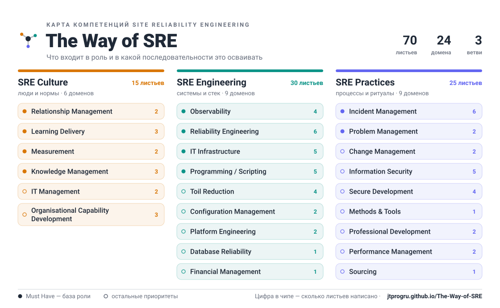

<h1 align="center">Привет, инженер
</h1>
<h2 align="center"> Всем, кому интересно развиваться в SRE направлении, посвящается! </h2>

<p align="center">
  <a href="https://github.com/jtprogru/The-Way-of-SRE/pulls">
    
  </a>
  <a href="LICENSE">
    
  </a>
  <a href="https://t.me/+LFsXS2FuZiwwMzky">
    
  </a>
  <a href="https://t.me/+BPP6mMOs34s2Yzcy">
    
  </a>
</p>

<p align="center">
  Анонсы новых листьев — в <a href="https://t.me/+LFsXS2FuZiwwMzky">Telegram-канале</a>, обсуждение и вопросы — в <a href="https://t.me/+BPP6mMOs34s2Yzcy">чате</a>.
</p>

<p align="center">
  <picture>
    <source media="(prefers-color-scheme: dark)" srcset="./logo/cover-dark.svg">
    
  </picture>
</p>

> Вдохновлен проектом [The-Way-of-DevOps](https://github.com/evgeniy-kharchenko/The-Way-of-DevOps) за авторством [Евгения Харченко](https://github.com/evgeniy-kharchenko).

<!-- START doctoc generated TOC please keep comment here to allow auto update -->
<!-- DON'T EDIT THIS SECTION, INSTEAD RE-RUN doctoc TO UPDATE -->

- [Карта компетенций](#%D0%BA%D0%B0%D1%80%D1%82%D0%B0-%D0%BA%D0%BE%D0%BC%D0%BF%D0%B5%D1%82%D0%B5%D0%BD%D1%86%D0%B8%D0%B9)
- [Roadmap](#roadmap)
- [Локальный запуск сайта](#%D0%BB%D0%BE%D0%BA%D0%B0%D0%BB%D1%8C%D0%BD%D1%8B%D0%B9-%D0%B7%D0%B0%D0%BF%D1%83%D1%81%D0%BA-%D1%81%D0%B0%D0%B9%D1%82%D0%B0)
- [Документы проекта](#%D0%B4%D0%BE%D0%BA%D1%83%D0%BC%D0%B5%D0%BD%D1%82%D1%8B-%D0%BF%D1%80%D0%BE%D0%B5%D0%BA%D1%82%D0%B0)

<!-- END doctoc generated TOC please keep comment here to allow auto update -->

## Карта компетенций

Полная интерактивная карта с листьями (конкретные умения, материалы, best practices) живёт на сайте: <https://jtprogru.github.io/The-Way-of-SRE/>. Карта делится на три ветви:

- **[SRE Culture](https://jtprogru.github.io/The-Way-of-SRE/culture/)** — нормы, отношения, обмен опытом. Главный объект — люди и нормы. **15 листьев** на полной глубине.
- **[SRE Engineering](https://jtprogru.github.io/The-Way-of-SRE/engineering/)** — технические компетенции и стек. Главный объект — системы. **30 листьев** на полной глубине.
- **[SRE Practices](https://jtprogru.github.io/The-Way-of-SRE/practices/)** — операционные процессы и ритуалы. Главный объект — процесс. **25 листьев** на полной глубине.

Всё дерево целиком, от корня до подлистов, — на странице [Mind map](https://jtprogru.github.io/The-Way-of-SRE/mindmap/): двусторонняя карта с зумом, фильтром по приоритету и сворачиванием веток.

Принцип разделения ветвей, политика контроля детализации, оси priority и SFIA — в [Методологии](https://jtprogru.github.io/The-Way-of-SRE/methodology/).

## Roadmap

Последовательность развития компетенций и приоритеты (Must Have / Mandatory / Nice to have / On Demand) — на странице [Приоритеты](https://jtprogru.github.io/The-Way-of-SRE/priorities/) сайта; определения осей — в [Методологии](https://jtprogru.github.io/The-Way-of-SRE/methodology/).

Изначальный план новых листьев (10 шт) закрыт; следующая фаза — листья из open-questions / TBD-маркеров уже существующих.

## Локальный запуск сайта

Проект — Astro Starlight. Команды собраны в `Makefile`, `make` без аргументов покажет список:

```bash
make dev      # dev-сервер на http://localhost:4321/The-Way-of-SRE/
make build    # билд в dist/
make preview  # локальный preview готовой сборки
make check    # всё, что гоняет CI: оглавление, линт, типы, сборка, стиль листьев
```

Зависимости устанавливаются автоматически при первом запуске любой цели. Проверка на PR — это ровно `make check`, так что зелёный прогон локально означает зелёный CI. Оглавление README цель не правит, а сверяет: если оно устарело, она падает и просит запустить `make toc`.

Эквивалент без Makefile:

```bash
bun install && bun run dev
```

Отдельно — стиль-чек листьев, механическая часть чеклиста из `inventory/style-guide.md`:

```bash
make style                                                    # весь корпус
make style LEAF=src/content/docs/culture/runbooks.md   # один лист
```

Как он устроен и почему пороги именно такие — в [`tools/style/README.md`](tools/style/README.md).

Деплой на GitHub Pages — автоматический через `.github/workflows/deploy-site.yml` на каждый push в `main`, затрагивающий Astro-проект.

## Документы проекта

Все документы публикуются на сайте; исходники — в `src/content/docs/`.

- [Мотивация](https://jtprogru.github.io/The-Way-of-SRE/about/) — зачем проект существует и для кого (`src/content/docs/about.mdx`).
- [Формат проекта](https://jtprogru.github.io/The-Way-of-SRE/format/) — как устроена карта, шаблон листа, правила контрибуции (`src/content/docs/format.mdx`).
- [Методология](https://jtprogru.github.io/The-Way-of-SRE/methodology/) — методологический каркас, принцип разделения ветвей, оси priority и SFIA, источники структуры (`src/content/docs/methodology.mdx`).
- [`CONTRIBUTING.md`](CONTRIBUTING.md) — как приносить правки: рабочий процесс, добавление нового листа, проверки перед PR (в репозитории, не на сайте).
- [`inventory/overlaps.md`](inventory/overlaps.md) — рабочий артефакт ребаланса (в репозитории, не на сайте).
- [`inventory/tlroadmap-review.md`](inventory/tlroadmap-review.md) — разбор соседнего проекта tlroadmap.io (в репозитории, не на сайте).
- Шаблон листа — [`inventory/leaf-template.md`](inventory/leaf-template.md) (лежит вне каталога контента и на сайт не попадает).
- Заполненные листья — на сайте; исходники в `src/content/docs/<branch>/<slug>.md`, рядом с hub-страницами L1 той же ветви.
