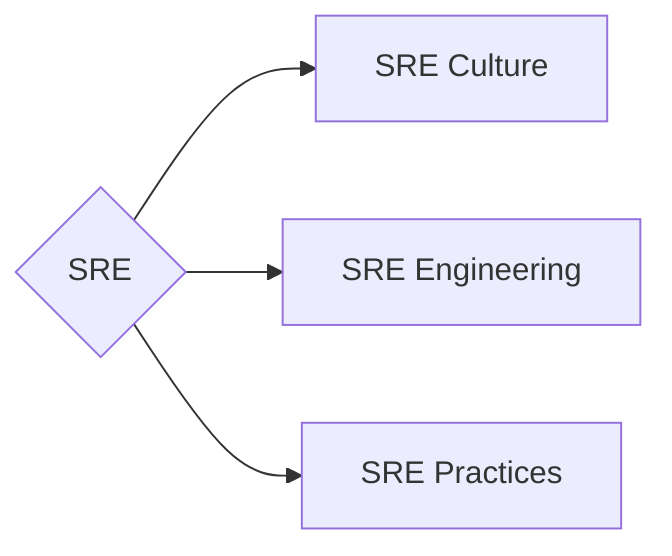

<h1 align="center">Привет, инженер
</h1>
<h2 align="center"> Всем, кому интересно развиваться в SRE направлении, посвящается! </h2>

<p align="center">
  <a href="https://github.com/jtprogru/The-Way-of-SRE/pulls">
    
  </a>
  <a href="LICENSE">
    
  </a>
</p>

<p align="center">
  
</p>

> Вдохновлен проектом [The-Way-of-DevOps](https://github.com/evgeniy-kharchenko/The-Way-of-DevOps) за авторством [Евгения Харченко](https://github.com/evgeniy-kharchenko).

<!-- START doctoc generated TOC please keep comment here to allow auto update -->
<!-- DON'T EDIT THIS SECTION, INSTEAD RE-RUN doctoc TO UPDATE -->

- [Карта компетенций](#%D0%BA%D0%B0%D1%80%D1%82%D0%B0-%D0%BA%D0%BE%D0%BC%D0%BF%D0%B5%D1%82%D0%B5%D0%BD%D1%86%D0%B8%D0%B9)
- [Roadmap](#roadmap)
- [Локальный запуск сайта](#%D0%BB%D0%BE%D0%BA%D0%B0%D0%BB%D1%8C%D0%BD%D1%8B%D0%B9-%D0%B7%D0%B0%D0%BF%D1%83%D1%81%D0%BA-%D1%81%D0%B0%D0%B9%D1%82%D0%B0)
- [Документы проекта](#%D0%B4%D0%BE%D0%BA%D1%83%D0%BC%D0%B5%D0%BD%D1%82%D1%8B-%D0%BF%D1%80%D0%BE%D0%B5%D0%BA%D1%82%D0%B0)

<!-- END doctoc generated TOC please keep comment here to allow auto update -->

## Карта компетенций

Узлы на схеме **кликабельны** — клик по ветви ведёт к её L1-карте на сайте. Полная интерактивная карта с листьями (конкретные умения, материалы, best practices) — <https://jtprogru.github.io/The-Way-of-SRE/>.


```mermaid
graph LR
    SRE{SRE}
    SRE --> SRECulture[SRE Culture]
    SRE --> SREEngineering[SRE Engineering]
    SRE --> SREPractices[SRE Practices]

    click SRECulture "https://jtprogru.github.io/The-Way-of-SRE/sre-culture/" "Перейти к SRE Culture"
    click SREEngineering "https://jtprogru.github.io/The-Way-of-SRE/sre-engineering/" "Перейти к SRE Engineering"
    click SREPractices "https://jtprogru.github.io/The-Way-of-SRE/sre-practices/" "Перейти к SRE Practices"
```

- **[SRE Culture](https://jtprogru.github.io/The-Way-of-SRE/sre-culture/)** — нормы, отношения, обмен опытом. Главный объект — люди и нормы. **8 листьев** на полной глубине.
- **[SRE Engineering](https://jtprogru.github.io/The-Way-of-SRE/sre-engineering/)** — технические компетенции и стек. Главный объект — системы. **23 листа** на полной глубине.
- **[SRE Practices](https://jtprogru.github.io/The-Way-of-SRE/sre-practices/)** — операционные процессы и ритуалы. Главный объект — процесс. **20 листьев** на полной глубине.

Принцип разделения ветвей, политика контроля детализации, оси priority и SFIA — в [Методологии](https://jtprogru.github.io/The-Way-of-SRE/methodology/).

## Roadmap

Последовательность развития компетенций и приоритеты (Must Have / Mandatory / Nice to have / On Demand) — на странице [/priorities/](https://jtprogru.github.io/The-Way-of-SRE/priorities/) сайта; определения осей — в [Методологии](https://jtprogru.github.io/The-Way-of-SRE/methodology/).

Изначальный план новых листьев (10 шт) закрыт; следующая фаза — листья из open-questions / TBD-маркеров уже существующих.

## Локальный запуск сайта

Проект — Astro Starlight. Команды доступны через [Task](https://taskfile.dev/):

```bash
task dev      # dev-сервер на http://localhost:4321/The-Way-of-SRE/
task build    # билд в dist/
task preview  # локальный preview готовой сборки
```

Зависимости устанавливаются автоматически при первом запуске любой задачи.

Эквивалент без Taskfile:

```bash
npm install && npm run dev
```

Деплой на GitHub Pages — автоматический через `.github/workflows/deploy-site.yml` на каждый push в `main`, затрагивающий Astro-проект.

## Документы проекта

Все документы публикуются на сайте; исходники — в `src/content/docs/`.

- [Мотивация](https://jtprogru.github.io/The-Way-of-SRE/about/) — зачем проект существует и для кого (`src/content/docs/about.mdx`).
- [Формат проекта](https://jtprogru.github.io/The-Way-of-SRE/format/) — как устроена карта, шаблон листа, правила контрибуции (`src/content/docs/format.mdx`).
- [Методология](https://jtprogru.github.io/The-Way-of-SRE/methodology/) — методологический каркас, принцип разделения ветвей, оси priority и SFIA, источники структуры (`src/content/docs/methodology.mdx`).
- [`inventory/overlaps.md`](inventory/overlaps.md) — рабочий артефакт ребаланса (в репозитории, не на сайте).
- [`inventory/tlroadmap-review.md`](inventory/tlroadmap-review.md) — разбор соседнего проекта tlroadmap.io (в репозитории, не на сайте).
- Шаблон листа — [`src/content/docs/leaves/_template.md`](src/content/docs/leaves/_template.md) (Astro игнорирует `_`-префикс, шаблон виден только в GitHub UI).
- Заполненные листья — на сайте; исходники в `src/content/docs/leaves/<branch>/<slug>.md`.
