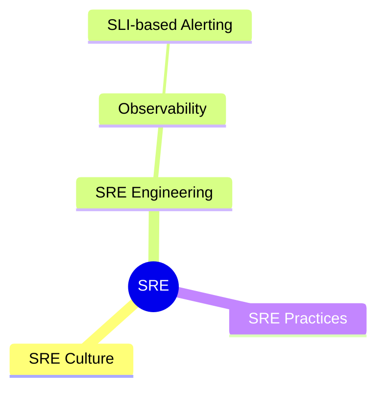

<h1 align="center">Привет, инженер
</h1>
<h2 align="center"> Всем, кому интересно развиваться в SRE направлении, посвящается! </h2>

  
  

  

> Вдохновлен проектом [The-Way-of-DevOps](https://github.com/evgeniy-kharchenko/The-Way-of-DevOps) за авторством [Евгения Харченко](https://github.com/evgeniy-kharchenko).

<!-- START doctoc generated TOC please keep comment here to allow auto update -->
<!-- DON'T EDIT THIS SECTION, INSTEAD RE-RUN doctoc TO UPDATE -->

- [Карта компетенций](#%D0%BA%D0%B0%D1%80%D1%82%D0%B0-%D0%BA%D0%BE%D0%BC%D0%BF%D0%B5%D1%82%D0%B5%D0%BD%D1%86%D0%B8%D0%B9)
- [Roadmap](#roadmap)
- [Документы проекта](#%D0%B4%D0%BE%D0%BA%D1%83%D0%BC%D0%B5%D0%BD%D1%82%D1%8B-%D0%BF%D1%80%D0%BE%D0%B5%D0%BA%D1%82%D0%B0)

<!-- END doctoc generated TOC please keep comment here to allow auto update -->

## Карта компетенций

Визуальная карта направлений в SRE. Растёт постепенно: новый заполненный лист появляется на схеме новым узлом.

```mermaid
mindmap
  root((SRE))
    SRE Culture
    SRE Engineering
      Observability
        SLI-based Alerting
    SRE Practices
```

Навигация по карте — через список ссылок ниже:

- **[SRE Culture](docs/sre-culture.md)** — нормы, отношения, обмен опытом. Главный объект — люди и нормы.
- **[SRE Engineering](docs/sre-engineering.md)** — технические компетенции и стек. Главный объект — системы.
  - **[SLI-based Alerting](docs/leaves/engineering/sli-based-alerting.md)** — эталонный лист (Observability).
- **[SRE Practices](docs/sre-practices.md)** — операционные процессы и ритуалы. Главный объект — процесс.

Принцип разделения ветвей и политика контроля детализации — в [docs/methodology.md](docs/methodology.md).

## Roadmap

Последовательность развития компетенций и приоритеты (Must Have / Mandatory / Nice to have / On Demand) — в [docs/sre-priorities.md](docs/sre-priorities.md).

## Документы проекта

- [docs/about.md](docs/about.md) — мотивация, формат проекта, дисклеймер, контрибуция.
- [docs/methodology.md](docs/methodology.md) — методологический каркас и внешние источники.
- [docs/sre-priorities.md](docs/sre-priorities.md) — приоритеты развития.
- [docs/_inventory/overlaps.md](docs/_inventory/overlaps.md) — инвентаризация пересечений (рабочий артефакт ребаланса).
- [docs/leaves/_template.md](docs/leaves/_template.md) — шаблон leaf-страницы.
- [docs/leaves/](docs/leaves/) — заполненные листья роадмапа.
