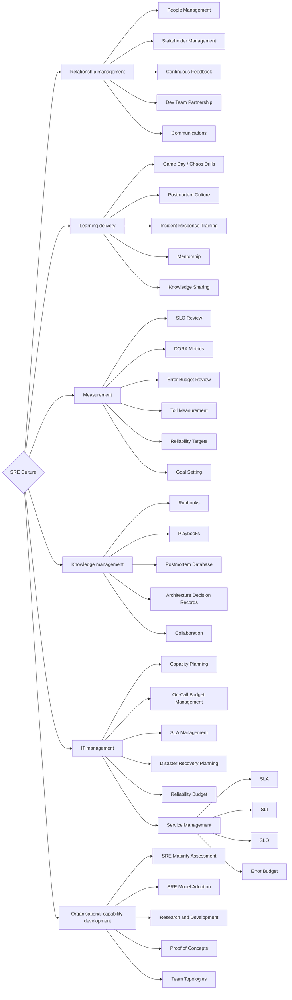

# SRE Culture
Компетенции для развития в ветке `SRE Culture`:

```mermaid
graph LR
    SRECulture{SRE Culture}
    SRECulture --> RLMT[Relationship management]
    SRECulture --> ETDL[Learning delivery]
    SRECulture --> MEAS[Measurement]
    SRECulture --> KNOW[Knowledge management]
    SRECulture --> ITMG[IT management]
    SRECulture --> OCDV[Organisational capability development]

    RLMT --> PeopleManagement[People Management]
    RLMT --> StakeholderMgmt[Stakeholder Management]
    RLMT --> ContinuousFeedback[Continuous Feedback]
    RLMT --> DevTeamPartnership[Dev Team Partnership]
    RLMT --> Communications

    ETDL --> GameDay[Game Day / Chaos Drills]
    ETDL --> PostmortemCulture[Postmortem Culture]
    ETDL --> IncidentResponseTraining[Incident Response Training]
    ETDL --> Mentorship
    ETDL --> KnowledgeSharing[Knowledge Sharing]

    MEAS --> SLOReview[SLO Review]
    MEAS --> DORAMetrics[DORA Metrics]
    MEAS --> ErrorBudgetReview[Error Budget Review]
    MEAS --> ToilMeasurement[Toil Measurement]
    MEAS --> ReliabilityTargets[Reliability Targets]
    MEAS --> GoalSetting[Goal Setting]

    KNOW --> Runbooks
    KNOW --> Playbooks
    KNOW --> PostmortemDB[Postmortem Database]
    KNOW --> ArchDecisionRecords[Architecture Decision Records]
    KNOW --> Collaboration

    ITMG --> CapacityPlanning[Capacity Planning]
    ITMG --> OnCallBudget[On-Call Budget Management]
    ITMG --> SLAManagement[SLA Management]
    ITMG --> DisasterRecoveryPlanning[Disaster Recovery Planning]
    ITMG --> BudgetReliability[Reliability Budget]
    ITMG --> ServiceManagement[Service Management]
    ServiceManagement --> SLA
    ServiceManagement --> SLI
    ServiceManagement --> SLO
    ServiceManagement --> ErrorBudget[Error Budget]

    OCDV --> SREMaturityAssessment[SRE Maturity Assessment]
    OCDV --> SREModelAdoption[SRE Model Adoption]
    OCDV --> RnD[Research and Development]
    OCDV --> PoC[Proof of Concepts]
    OCDV --> TeamTopologies[Team Topologies]
```
