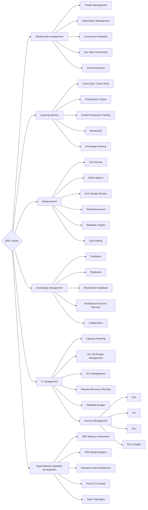

# SRE Culture

Ветвь развития, посвящённая совершенствованию компетенций и навыков, связанных с **построением культуры надёжности** в организации. Главный объект деятельности — люди и нормы: договорённости, отношения, обмен опытом, метрики как инструмент разговора. Деятельность в этом направлении призвана сформировать безвиновную культуру (blameless culture), развить reliability mindset, наладить on-call культуру и обеспечить эффективный обмен знаниями.

Ключевой принцип: **надёжность — это фича, а не afterthought**.

## Компетенции верхнего уровня

- **Relationship management** — выстраивание партнёрства между SRE и продуктовыми командами, управление ожиданиями стейкхолдеров, формирование культуры совместной ответственности за надёжность. SRE работают вместе с разработчиками, а не вместо них.
- **Learning delivery** — распространение SRE-знаний внутри организации: game day, обучение incident response, менторство, постмортем как инструмент обучения, а не порицания.
- **Measurement** — определение и отслеживание метрик надёжности: DORA-метрики, SLI/SLO/SLA, error budget burn rate, toil ratio. Основа data-driven reliability decisions.
- **Knowledge management** — систематическое накопление и распространение знаний об эксплуатации систем: runbooks, playbooks, постмортемы, архитектурные решения. База знаний снижает когнитивную нагрузку и время восстановления при инцидентах.
- **IT management** — управление надёжностью и жизненным циклом IT-систем: capacity planning, бюджет on-call нагрузки, SLA с внешними сервисами, принятие архитектурных решений с точки зрения надёжности.
- **Organisational capability development** — развитие зрелости SRE-практик в организации: оценка текущего состояния надёжности, внедрение SRE-модели (embedded vs centralised), масштабирование практик на другие команды.

## Карта компетенций

Компетенции для развития в ветке `SRE Culture`:

