# SRE Engineering

Ветвь развития, посвящённая совершенствованию **технических компетенций и навыков**, необходимых для обеспечения надёжности, масштабируемости и производительности систем. Главный объект деятельности — технические артефакты: код, инфраструктура, инструменты наблюдаемости и автоматизации.

Ветвь включает наблюдаемость (observability), управление SLO/SLI/SLA, снижение toil, chaos engineering, capacity planning и всё, что позволяет системам быть **надёжными по своей природе**.

## Компетенции верхнего уровня

- **Observability** — построение и поддержка систем наблюдаемости: метрики, логи, трейсы (три столпа observability). Включает разработку dashboards, alerting-стратегий и SLI-based мониторинга. Observability — это возможность понять внутреннее состояние системы по её внешним проявлениям.
- **Reliability Engineering** — определение и управление SLI/SLO/SLA, error budget policy, capacity planning и проектирование систем с учётом надёжности. Включает chaos engineering и fault injection для проверки устойчивости.
- **Toil Reduction** — выявление, измерение и автоматизация ручного повторяющегося операционного труда (toil). Цель — удерживать долю toil ниже 50% рабочего времени команды, высвобождая ресурсы для engineering-работы.
- **Configuration management** — управление конфигурацией инфраструктуры и приложений как кодом (IaC), обеспечение воспроизводимости и предсказуемости состояния систем.
- **IT infrastructure** — эксплуатация, проектирование и оптимизация инфраструктуры с точки зрения надёжности: отказоустойчивость, резервирование, disaster recovery, производительность.
- **Programming/scripting** — разработка инструментов для автоматизации, операционных сервисов, систем контроля надёжности и снижения toil. SRE пишет код — это принципиальное отличие от классических ops.
- **Database reliability** — обеспечение надёжности хранилищ данных: backup/restore, репликация, performance tuning, DR-сценарии для БД, мониторинг consistency.

## Карта компетенций

Компетенции для развития в ветке `SRE Engineering`:

```mermaid
graph LR
    SREEngineering{SRE Engineering}
    SREEngineering --> OBSR[Observability]
    SREEngineering --> RELY[Reliability Engineering]
    SREEngineering --> TOIL[Toil Reduction]
    SREEngineering --> CFMG[Configuration management]
    SREEngineering --> ITOP[IT infrastructure]
    SREEngineering --> PROG[Programming/scripting]
    SREEngineering --> DBAD[Database reliability]

    OBSR --> Metrics[Metrics]
    Metrics --> Prometheus
    Metrics --> VictoriaMetrics
    Metrics --> Datadog
    Metrics --> Grafana
    OBSR --> Logging[Logging]
    Logging --> ELK[ELK Stack]
    Logging --> Loki
    Logging --> Graylog
    Logging --> Splunk
    OBSR --> Tracing[Distributed Tracing]
    Tracing --> Jaeger
    Tracing --> Tempo
    Tracing --> Zipkin
    OBSR --> OpenTelemetry
    OBSR --> AlertingStrategy[Alerting Strategy]
    AlertingStrategy --> SLIBasedAlerting[SLI-Based Alerting]
    AlertingStrategy --> ErrorBudgetBurnRate[Error Budget Burn Rate]
    AlertingStrategy --> AlertFatigueMgmt[Alert Fatigue Management]
    OBSR --> SyntheticMonitoring[Synthetic Monitoring]
    OBSR --> RUMMonitoring[Real User Monitoring]

    RELY --> SLOManagement[SLO Management]
    SLOManagement --> SLIDefinition[SLI Definition]
    SLOManagement --> SLOSetting[SLO Setting]
    SLOManagement --> ErrorBudgetPolicy[Error Budget Policy]
    RELY --> ChaosEngineering[Chaos Engineering]
    ChaosEngineering --> FaultInjection[Fault Injection]
    ChaosEngineering --> ChaosMesh[Chaos Mesh]
    ChaosEngineering --> Litmus
    RELY --> CapacityPlanning[Capacity Planning]
    CapacityPlanning --> LoadTesting[Load Testing]
    LoadTesting --> k6
    LoadTesting --> Gatling
    LoadTesting --> Locust
    CapacityPlanning --> PerformanceProfiling[Performance Profiling]
    RELY --> DisasterRecovery[Disaster Recovery]
    DisasterRecovery --> RPO[RPO/RTO Design]
    DisasterRecovery --> BackupValidation[Backup Validation]
    DisasterRecovery --> FailoverTesting[Failover Testing]
    RELY --> ResiliencePatterns[Resilience Patterns]
    ResiliencePatterns --> CircuitBreaker[Circuit Breaker]
    ResiliencePatterns --> RetryStrategies[Retry Strategies]
    ResiliencePatterns --> Bulkhead
    ResiliencePatterns --> Timeout

    TOIL --> ToilIdentification[Toil Identification]
    TOIL --> ToilAutomation[Toil Automation]
    ToilAutomation --> OperatorPattern[Operator Pattern]
    ToilAutomation --> SelfHealing[Self-Healing Systems]
    TOIL --> ToilTracking[Toil Tracking]

    CFMG --> IaaC[Infrastructure as Code]
    IaaC --> Terraform
    IaaC --> Pulumi
    IaaC --> Ansible
    IaaC --> AWSCDK[AWS CDK]
    CFMG --> GitOps
    GitOps --> ArgoCD
    GitOps --> FluxCD

    ITOP --> OS[Operating System]
    OS --> Networking
    Networking --> NetworkTools[Network Tools]
    NetworkTools --> NetTools[ping/traceroute/ss/netstat/iptables/dig/tcpdump/nmap/curl]
    Networking --> Protocols
    Protocols --> NetworkProtocols[TCP/IP/UDP/HTTP/HTTPS/gRPC/DNS/TLS]
    OS --> Virtualization
    OS --> MemoryStorage[Memory/Storage]
    OS --> FS[File System]
    OS --> POSIX[POSIX Basics]
    OS --> Processes
    OS --> DebugTools[Debug Tools]
    DebugTools --> DebugTools1[ps/top/htop/atop/lsof/iotop/iostat/strace/perf/bpftrace]
    OS --> Performance
    OS --> Distributions
    Distributions --> Ubuntu
    Distributions --> RHEL
    Distributions --> Debian
    ITOP --> Containerization[Containerization]
    Containerization --> Docker
    Containerization --> Podman
    ITOP --> ContainerOrchestration[Container Orchestration]
    ContainerOrchestration --> Kubernetes
    ContainerOrchestration --> Nomad
    ITOP --> ServiceMesh[Service Mesh]
    ServiceMesh --> Istio
    ServiceMesh --> Linkerd
    ITOP --> CloudProviders[Cloud Providers]
    CloudProviders --> AWS
    CloudProviders --> GCP[Google Cloud Platform]
    CloudProviders --> Azure

    PROG --> ProgrammingLanguages[Programming Languages]
    ProgrammingLanguages --> Go
    ProgrammingLanguages --> Python
    ProgrammingLanguages --> Shell
    Shell --> bash
    Shell --> CompilingTools[Build Tools]
    CompilingTools --> make
    Shell --> TextManipulationTools[Text Manipulation]
    TextManipulationTools --> TxtManipulationTools[sed/awk/cut/grep/jq/yq]
    PROG --> CICD[CI/CD]
    CICD --> GitHubActions[GitHub Actions]
    CICD --> GitLabCI[GitLab CI]
    CICD --> Jenkins

    DBAD --> DBMS
    DBMS --> SQLDB[SQL Databases]
    DBMS --> NoSQLDB[NoSQL Databases]
    DBAD --> DBReliability[DB Reliability]
    DBReliability --> Replication
    DBReliability --> BackupRestore[Backup & Restore]
    DBReliability --> DBMonitoring[DB Monitoring]
    DBReliability --> DBPerformance[DB Performance Tuning]
```

