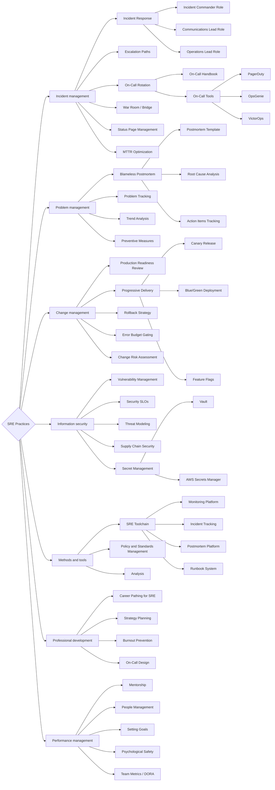

# SRE Practices
Компетенции для развития в ветке `SRE Practices`:

```mermaid
graph LR
    SREPractices{SRE Practices}
    SREPractices --> USUP[Incident management]
    SREPractices --> PBMG[Problem management]
    SREPractices --> CHMG[Change management]
    SREPractices --> SCTY[Information security]
    SREPractices --> METL[Methods and tools]
    SREPractices --> PDSV[Professional development]
    SREPractices --> PEMT[Performance management]

    USUP --> IncidentResponse[Incident Response]
    IncidentResponse --> IncidentCommander[Incident Commander Role]
    IncidentResponse --> CommsLead[Communications Lead Role]
    IncidentResponse --> OpsLead[Operations Lead Role]
    USUP --> EscalationPaths[Escalation Paths]
    USUP --> OnCallRotation[On-Call Rotation]
    OnCallRotation --> OnCallHandbook[On-Call Handbook]
    OnCallRotation --> OnCallTools[On-Call Tools]
    OnCallTools --> PagerDuty
    OnCallTools --> OpsGenie
    OnCallTools --> VictorOps
    USUP --> WarRoom[War Room / Bridge]
    USUP --> StatusPage[Status Page Management]
    USUP --> MTTR[MTTR Optimization]

    PBMG --> BlamelessPostmortem[Blameless Postmortem]
    BlamelessPostmortem --> PostmortemTemplate[Postmortem Template]
    BlamelessPostmortem --> RootCauseAnalysis[Root Cause Analysis]
    BlamelessPostmortem --> ActionItems[Action Items Tracking]
    PBMG --> ProblemTracking[Problem Tracking]
    PBMG --> TrendAnalysis[Trend Analysis]
    PBMG --> PreventiveMeasures[Preventive Measures]

    CHMG --> ProductionReadiness[Production Readiness Review]
    CHMG --> ProgressiveDelivery[Progressive Delivery]
    ProgressiveDelivery --> CanaryRelease[Canary Release]
    ProgressiveDelivery --> BlueGreen[Blue/Green Deployment]
    ProgressiveDelivery --> FeatureFlags[Feature Flags]
    CHMG --> RollbackStrategy[Rollback Strategy]
    CHMG --> ErrorBudgetGating[Error Budget Gating]
    CHMG --> ChangeRiskAssessment[Change Risk Assessment]

    SCTY --> VulnerabilityManagement[Vulnerability Management]
    SCTY --> SecuritySLOs[Security SLOs]
    SCTY --> ThreatModeling[Threat Modeling]
    SCTY --> SupplyChainSecurity[Supply Chain Security]
    SCTY --> SecretManagement[Secret Management]
    SecretManagement --> Vault
    SecretManagement --> AWSSM[AWS Secrets Manager]

    METL --> SREToolchain[SRE Toolchain]
    SREToolchain --> MonitoringPlatform[Monitoring Platform]
    SREToolchain --> IncidentTracking[Incident Tracking]
    SREToolchain --> PostmortemPlatform[Postmortem Platform]
    SREToolchain --> RunbookSystem[Runbook System]
    METL --> PolicyManagement[Policy and Standards Management]
    METL --> Analysis

    PDSV --> CareerPathing[Career Pathing for SRE]
    PDSV --> StrategyPlanning[Strategy Planning]
    PDSV --> BurnoutPrevention[Burnout Prevention]
    PDSV --> OnCallDesign[On-Call Design]

    PEMT --> Mentorship
    PEMT --> PeopleMgmt[People Management]
    PEMT --> SettingGoals[Setting Goals]
    PEMT --> PsychologicalSafety[Psychological Safety]
    PEMT --> TeamMetrics[Team Metrics / DORA]
```
