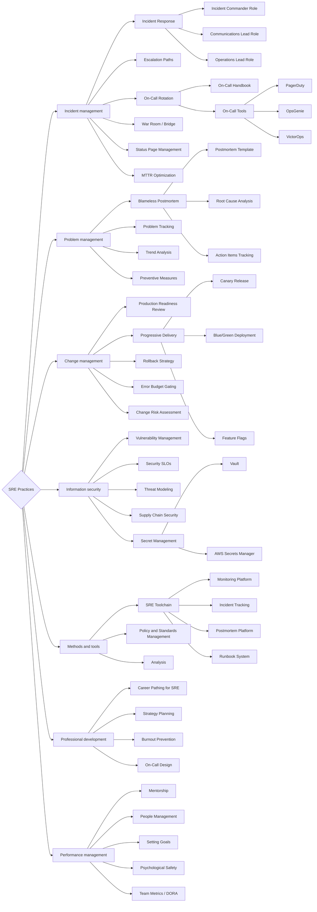

# SRE Practices

Ветвь развития, посвящённая совершенствованию **операционных процессов**: управление инцидентами, постмортемы, управление изменениями, on-call процессы, runbook-культура, SLO-ревью. Главный объект деятельности — процессы и ритуалы: последовательность действий, повторяемые сценарии, операционная зрелость.

Всё это составляет операционную зрелость команды и организации.

## Компетенции верхнего уровня

- **Incident management** — координация реагирования на инциденты: роли (IC, Comms Lead, Ops Lead), escalation paths, war room процессы, коммуникация со стейкхолдерами. Цель — минимизировать MTTR при соблюдении blameless-принципов.
- **Problem management** — проведение постмортемов (blameless postmortems), выявление корневых причин инцидентов, разработка action items и их отслеживание. Проблема — это потенциальный источник инцидентов; её устранение снижает риски.
- **Change management** — безопасное управление изменениями в production: progressive delivery, feature flags, canary releases, rollback-стратегии, оценка риска изменений с точки зрения error budget.
- **Information security** — управление уязвимостями, обеспечение надёжности с учётом требований безопасности (security SLOs), участие в threat modeling и безопасности supply chain.
- **Methods and tools** — выбор, внедрение и совершенствование инструментария SRE-команды: системы мониторинга, incident-трекеры, платформы для постмортемов, runbook-системы.
- **Professional development** — профессиональный рост SRE-инженеров: планирование карьерного пути, определение зон ответственности, дизайн on-call rotation, борьба с burnout.
- **Performance management** — наставничество, постановка целей, оценка производительности команды через объективные метрики (не только on-call героизм), развитие культуры психологической безопасности.

## Карта компетенций

Компетенции для развития в ветке `SRE Practices`:

