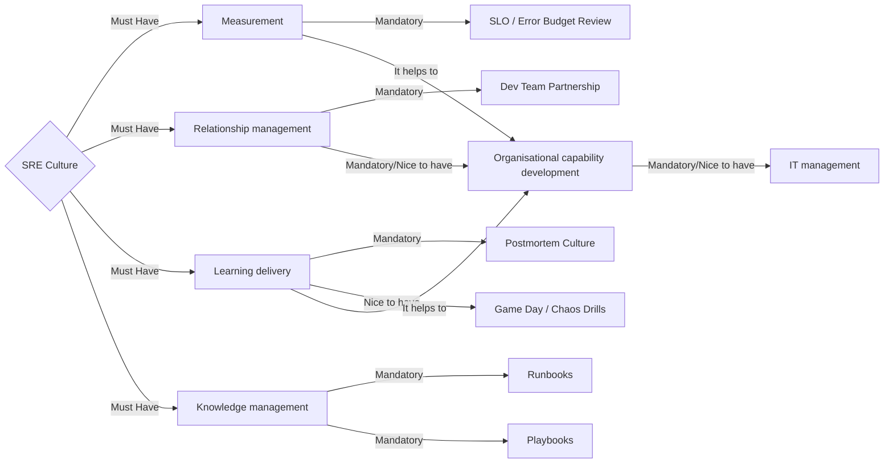
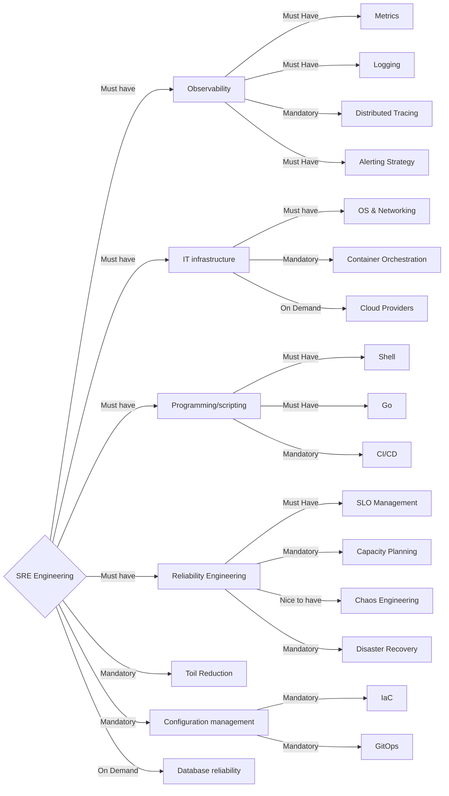
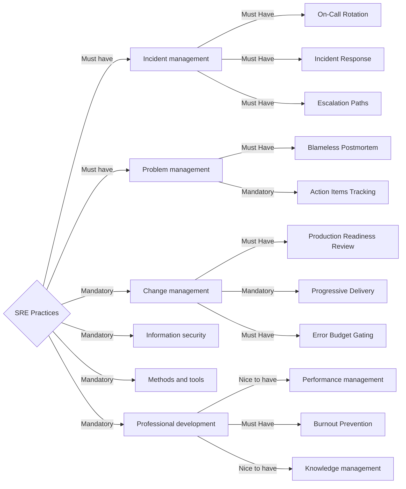

# SRE Roadmap

Предполагаемая последовательность совершенствования компетенций с приоритетами.

<!-- START doctoc generated TOC please keep comment here to allow auto update -->
<!-- DON'T EDIT THIS SECTION, INSTEAD RE-RUN doctoc TO UPDATE -->

- [SRE Culture](#sre-culture)
- [SRE Engineering](#sre-engineering)
- [SRE Practices](#sre-practices)

<!-- END doctoc generated TOC please keep comment here to allow auto update -->

## SRE Culture

## SRE Engineering

## SRE Practices

