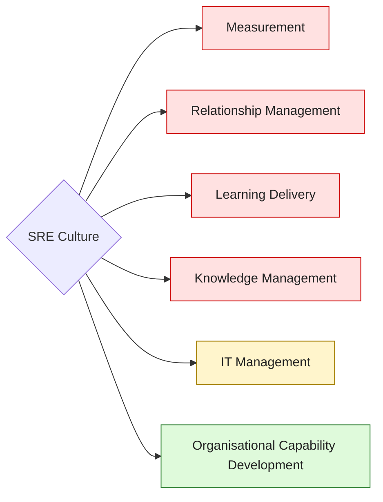
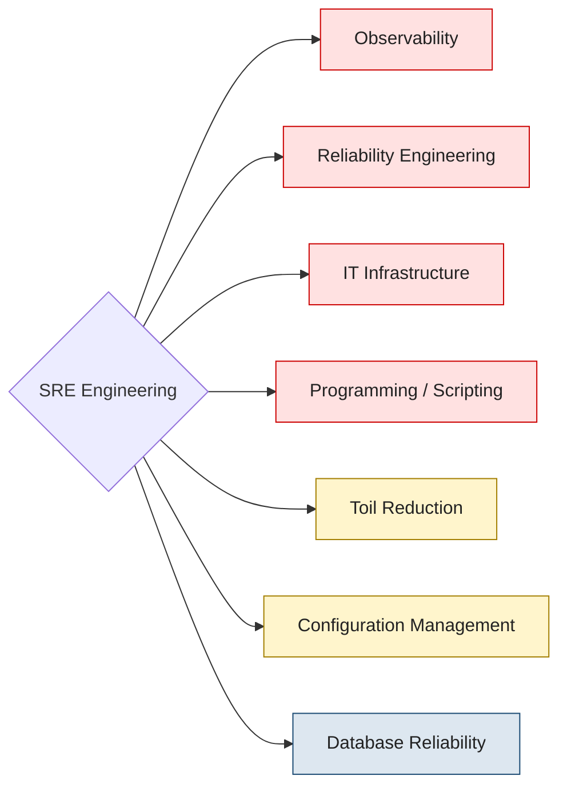
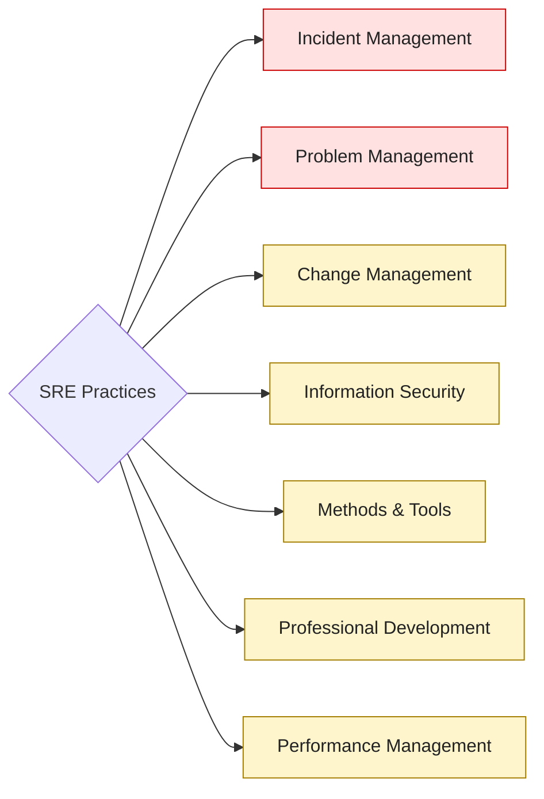

# SRE Roadmap

Документ организует компетенции трёх ветвей по **приоритету для роли SRE**. Это одна из двух осей развития; вторая — уровень зрелости инженера — хранится отдельно.

<!-- START doctoc generated TOC please keep comment here to allow auto update -->
<!-- DON'T EDIT THIS SECTION, INSTEAD RE-RUN doctoc TO UPDATE -->

- [Две независимые оси](#%D0%B4%D0%B2%D0%B5-%D0%BD%D0%B5%D0%B7%D0%B0%D0%B2%D0%B8%D1%81%D0%B8%D0%BC%D1%8B%D0%B5-%D0%BE%D1%81%D0%B8)
  - [Priority — обязательность для роли](#priority--%D0%BE%D0%B1%D1%8F%D0%B7%D0%B0%D1%82%D0%B5%D0%BB%D1%8C%D0%BD%D0%BE%D1%81%D1%82%D1%8C-%D0%B4%D0%BB%D1%8F-%D1%80%D0%BE%D0%BB%D0%B8)
  - [SFIA — уровень зрелости инженера](#sfia--%D1%83%D1%80%D0%BE%D0%B2%D0%B5%D0%BD%D1%8C-%D0%B7%D1%80%D0%B5%D0%BB%D0%BE%D1%81%D1%82%D0%B8-%D0%B8%D0%BD%D0%B6%D0%B5%D0%BD%D0%B5%D1%80%D0%B0)
- [SRE Culture](#sre-culture)
- [SRE Engineering](#sre-engineering)
- [SRE Practices](#sre-practices)

<!-- END doctoc generated TOC please keep comment here to allow auto update -->

## Две независимые оси

Этот документ оперирует **только осью «priority»**. Не путать с уровнем SFIA — это разные измерения. Компетенция может быть Must Have даже на L3 (Junior) или Nice to have на L6+ (Principal).

### Priority — обязательность для роли

- 🔴 **Must Have** — без компетенции инженер не может выполнять основную работу.
- 🟡 **Mandatory** — компетенция, которой ожидаемо владеет любой SRE на стабильном этапе работы.
- 🟢 **Nice to have** — расширяет возможности, но не блокирует.
- 🔵 **On Demand** — изучается, когда проект требует.

В графе ниже каждая L1-компетенция помечена цветом в соответствии с приоритетом.

### SFIA — уровень зрелости инженера

Хранится во фронт-маттере каждой leaf-страницы (поле `sfia_levels`), уровни 3..7 соответствуют Junior → Principal. См. [фреймворк SFIA](https://sfia-online.org/en/about-sfia/the-context-for-sfia).

В этом документе SFIA-уровни **не отражаются** — для них есть отдельный источник правды.

## SRE Culture

```mermaid
graph LR
    classDef must fill:#ffe1e1,stroke:#cc0000,color:#222
    classDef mandatory fill:#fff5cc,stroke:#a37e00,color:#222
    classDef nice fill:#dffadb,stroke:#2a7d2e,color:#222
    classDef ondemand fill:#dde7f0,stroke:#1a4a73,color:#222

    SRECulture{SRE Culture}
    SRECulture --> MEAS[Measurement]:::must
    SRECulture --> RLMT[Relationship Management]:::must
    SRECulture --> ETDL[Learning Delivery]:::must
    SRECulture --> KNOW[Knowledge Management]:::must
    SRECulture --> ITMG[IT Management]:::mandatory
    SRECulture --> OCDV[Organisational Capability Development]:::nice
```

L2-компетенции под каждой ветвью:

- 🔴 **[Measurement](sre-culture.md)** — SLO / Budget Review, DORA Metrics, Toil Measurement, Goal Setting.
- 🔴 **[Relationship Management](sre-culture.md)** — People Management, Stakeholder Management, Continuous Feedback, Dev Team Partnership, Communications.
- 🔴 **[Learning Delivery](sre-culture.md)** — Game Day / Chaos Drills, Postmortem Culture, Incident Response Training, Mentorship, Knowledge Sharing.
- 🔴 **[Knowledge Management](sre-culture.md)** — Runbooks, Playbooks, Postmortem Database, Architecture Decision Records, Collaboration.
- 🟡 **[IT Management](sre-culture.md)** — On-Call Budget Management, DR Policy & Stakeholders, SLO Governance.
- 🟢 **[Organisational Capability Development](sre-culture.md)** — SRE Maturity Assessment, SRE Model Adoption, Research & PoC, Team Topologies.

## SRE Engineering

```mermaid
graph LR
    classDef must fill:#ffe1e1,stroke:#cc0000,color:#222
    classDef mandatory fill:#fff5cc,stroke:#a37e00,color:#222
    classDef nice fill:#dffadb,stroke:#2a7d2e,color:#222
    classDef ondemand fill:#dde7f0,stroke:#1a4a73,color:#222

    SREEngineering{SRE Engineering}
    SREEngineering --> OBSR[Observability]:::must
    SREEngineering --> RELY[Reliability Engineering]:::must
    SREEngineering --> ITOP[IT Infrastructure]:::must
    SREEngineering --> PROG[Programming / Scripting]:::must
    SREEngineering --> TOIL[Toil Reduction]:::mandatory
    SREEngineering --> CFMG[Configuration Management]:::mandatory
    SREEngineering --> DBAD[Database Reliability]:::ondemand
```

L2-компетенции под каждой ветвью:

- 🔴 **[Observability](sre-engineering.md)** — Metrics, Logging, Distributed Tracing, [SLI-based Alerting](leaves/engineering/sli-based-alerting.md), End-User Monitoring.
- 🔴 **[Reliability Engineering](sre-engineering.md)** — SLO Engineering, Chaos Engineering, Capacity Planning, Disaster Recovery, Resilience Patterns.
- 🔴 **[IT Infrastructure](sre-engineering.md)** — Networking, Operating Systems, Containerization & Orchestration, Service Mesh, Cloud Providers.
- 🔴 **[Programming / Scripting](sre-engineering.md)** — Programming Languages, Shell & CLI Craft, CI/CD.
- 🟡 **[Toil Reduction](sre-engineering.md)** — Toil Identification, Toil Automation, Toil Tracking.
- 🟡 **[Configuration Management](sre-engineering.md)** — Infrastructure as Code, GitOps.
- 🔵 **[Database Reliability](sre-engineering.md)** — DB Engines, Replication, Backup & Restore, Performance & Monitoring.

## SRE Practices

```mermaid
graph LR
    classDef must fill:#ffe1e1,stroke:#cc0000,color:#222
    classDef mandatory fill:#fff5cc,stroke:#a37e00,color:#222
    classDef nice fill:#dffadb,stroke:#2a7d2e,color:#222
    classDef ondemand fill:#dde7f0,stroke:#1a4a73,color:#222

    SREPractices{SRE Practices}
    SREPractices --> USUP[Incident Management]:::must
    SREPractices --> PBMG[Problem Management]:::must
    SREPractices --> CHMG[Change Management]:::mandatory
    SREPractices --> SCTY[Information Security]:::mandatory
    SREPractices --> METL[Methods & Tools]:::mandatory
    SREPractices --> PDSV[Professional Development]:::mandatory
    SREPractices --> PEMT[Performance Management]:::mandatory
```

L2-компетенции под каждой ветвью:

- 🔴 **[Incident Management](sre-practices.md)** — Incident Response, Escalation Paths, On-Call Rotation, Status Page Management, MTTR Optimization.
- 🔴 **[Problem Management](sre-practices.md)** — Blameless Postmortem, Problem Tracking, Trend Analysis, Preventive Measures, SLO Review Ritual.
- 🟡 **[Change Management](sre-practices.md)** — Production Readiness Review, Progressive Delivery, Rollback Strategy, Error Budget Gating, Change Risk Assessment.
- 🟡 **[Information Security](sre-practices.md)** — Vulnerability Management, Security SLOs, Threat Modeling, Supply Chain Security, Secret Management.
- 🟡 **[Methods & Tools](sre-practices.md)** — SRE Toolchain, Policy and Standards, Analysis.
- 🟡 **[Professional Development](sre-practices.md)** — Career Pathing for SRE, Strategy Planning, Burnout Prevention, On-Call Design.
- 🟡 **[Performance Management](sre-practices.md)** — Mentorship, People Management, Setting Goals, Psychological Safety, Performance Conversations.
