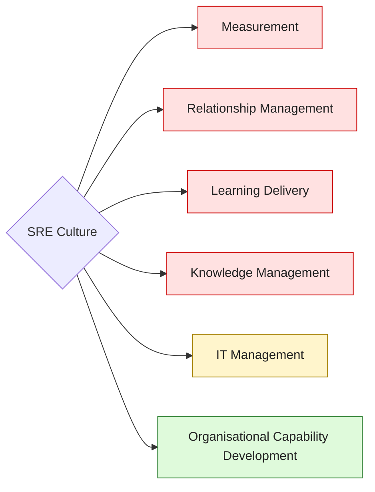
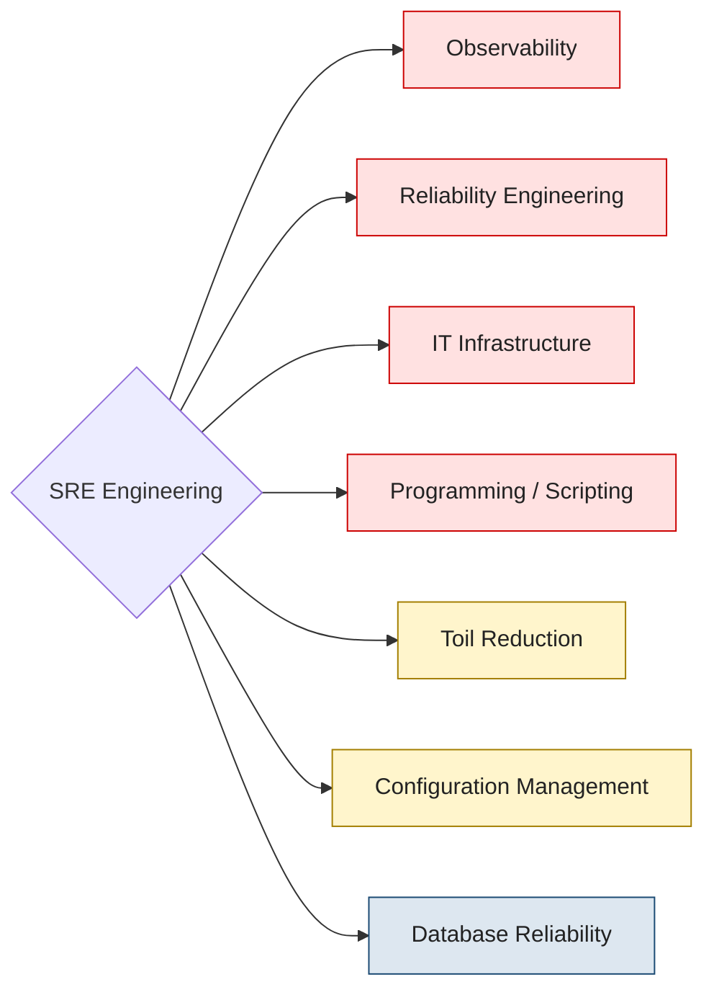
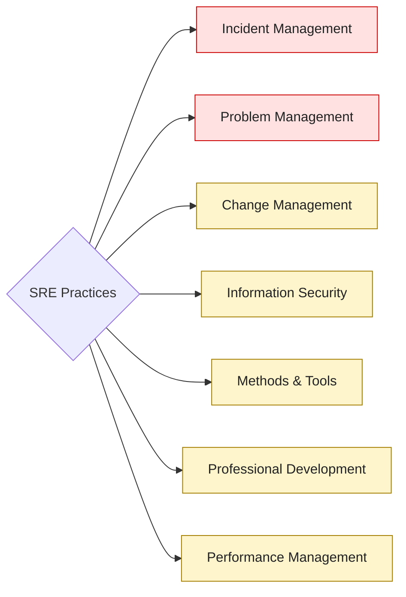

Документ организует компетенции трёх ветвей по **приоритету для роли SRE**. Это одна из двух осей развития; вторая — уровень зрелости инженера — хранится отдельно.

## Две независимые оси

Этот документ оперирует **только осью «priority»**. Не путать с уровнем SFIA — это разные измерения. Компетенция может быть Must Have даже на L3 (Junior) или Nice to have на L6+ (Principal).

### Priority — обязательность для роли

- 🔴 **Must Have** — без компетенции инженер не может выполнять основную работу.
- 🟡 **Mandatory** — компетенция, которой ожидаемо владеет любой SRE на стабильном этапе работы.
- 🟢 **Nice to have** — расширяет возможности, но не блокирует.
- 🔵 **On Demand** — изучается, когда проект требует.

В графах ниже каждая L1-компетенция помечена цветом в соответствии с приоритетом.

### SFIA — уровень зрелости инженера

Хранится во фронт-маттере каждой leaf-страницы (поле `sfia_levels`), уровни 3..7 соответствуют Junior → Principal. См. [фреймворк SFIA](https://sfia-online.org/en/about-sfia/the-context-for-sfia).

В этом документе SFIA-уровни **не отражаются** — для них есть отдельный источник правды.

## SRE Culture

L2-компетенции под каждой ветвью:

- 🔴 **[Measurement](/The-Way-of-SRE/sre-culture/)** — SLO / Budget Review, DORA Metrics, Toil Measurement.
- 🔴 **[Relationship Management](/The-Way-of-SRE/sre-culture/)** — Stakeholder Management, Continuous Feedback, Dev Team Partnership, Communications.
- 🔴 **[Learning Delivery](/The-Way-of-SRE/sre-culture/)** — Game Day / Chaos Drills, Postmortem Culture, Incident Response Training, Mentorship, Knowledge Sharing.
- 🔴 **[Knowledge Management](/The-Way-of-SRE/sre-culture/)** — Runbooks, Playbooks, Postmortem Database, Architecture Decision Records, Collaboration.
- 🟡 **[IT Management](/The-Way-of-SRE/sre-culture/)** — On-Call Budget Management, DR Policy & Stakeholders, SLO Governance.
- 🟢 **[Organisational Capability Development](/The-Way-of-SRE/sre-culture/)** — SRE Maturity Assessment, SRE Model Adoption, Research & PoC, Team Topologies.

## SRE Engineering

L2-компетенции под каждой ветвью:

- 🔴 **[Observability](/The-Way-of-SRE/sre-engineering/)** — Metrics, Logging, Distributed Tracing, [SLI-based Alerting](/The-Way-of-SRE/leaves/engineering/sli-based-alerting/), End-User Monitoring.
- 🔴 **[Reliability Engineering](/The-Way-of-SRE/sre-engineering/)** — SLO Engineering, Chaos Engineering, Capacity Planning, Disaster Recovery, Resilience Patterns.
- 🔴 **[IT Infrastructure](/The-Way-of-SRE/sre-engineering/)** — Networking, Operating Systems, Containerization & Orchestration, Service Mesh, Cloud Providers.
- 🔴 **[Programming / Scripting](/The-Way-of-SRE/sre-engineering/)** — Programming Languages, Shell & CLI Craft, CI/CD.
- 🟡 **[Toil Reduction](/The-Way-of-SRE/sre-engineering/)** — Toil Identification, Toil Automation, Toil Tracking.
- 🟡 **[Configuration Management](/The-Way-of-SRE/sre-engineering/)** — Infrastructure as Code, GitOps.
- 🔵 **[Database Reliability](/The-Way-of-SRE/sre-engineering/)** — DB Engines, Replication, Backup & Restore, Performance & Monitoring.

## SRE Practices

L2-компетенции под каждой ветвью:

- 🔴 **[Incident Management](/The-Way-of-SRE/sre-practices/)** — Incident Response, Escalation Paths, On-Call Rotation, Status Page Management, MTTR Optimization.
- 🔴 **[Problem Management](/The-Way-of-SRE/sre-practices/)** — Blameless Postmortem, Problem Tracking, Trend Analysis, Preventive Measures, SLO Review Ritual.
- 🟡 **[Change Management](/The-Way-of-SRE/sre-practices/)** — Production Readiness Review, Progressive Delivery, Rollback Strategy, Error Budget Gating, Change Risk Assessment.
- 🟡 **[Information Security](/The-Way-of-SRE/sre-practices/)** — Vulnerability Management, Security SLOs, Threat Modeling, Supply Chain Security, Secret Management.
- 🟡 **[Methods & Tools](/The-Way-of-SRE/sre-practices/)** — SRE Toolchain, Policy and Standards, Analysis.
- 🟡 **[Professional Development](/The-Way-of-SRE/sre-practices/)** — Career Pathing for SRE, Strategy Planning, Burnout Prevention, On-Call Design.
- 🟡 **[Performance Management](/The-Way-of-SRE/sre-practices/)** — People Management, Setting Goals, Psychological Safety, Performance Conversations.
